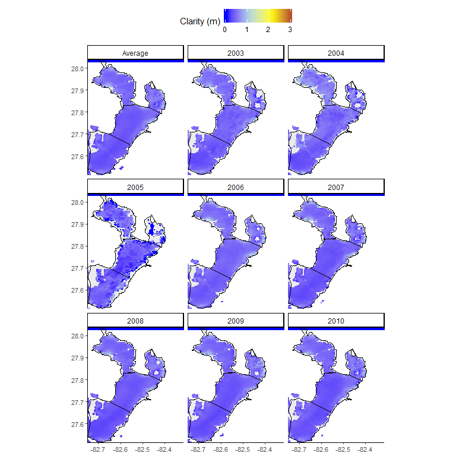
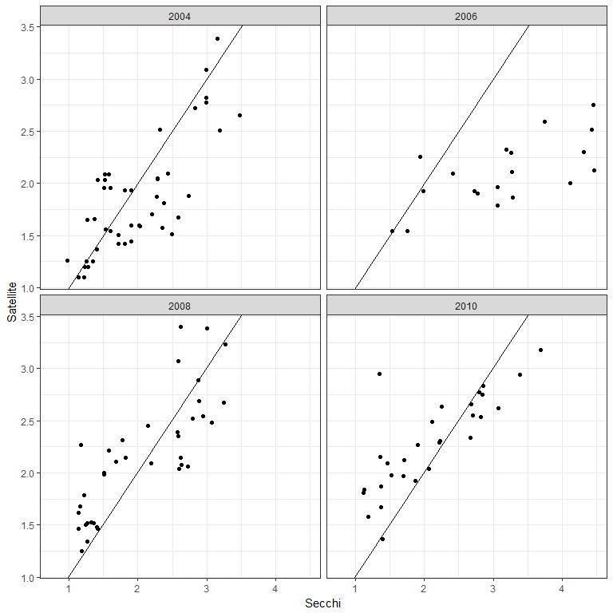
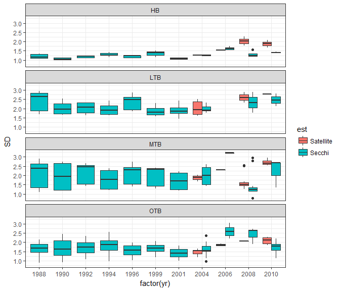
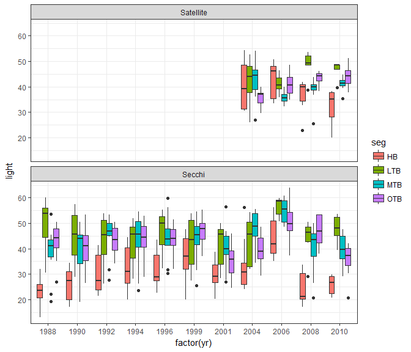
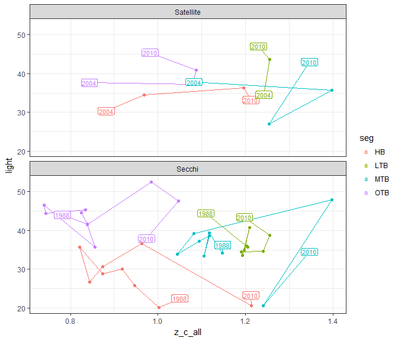
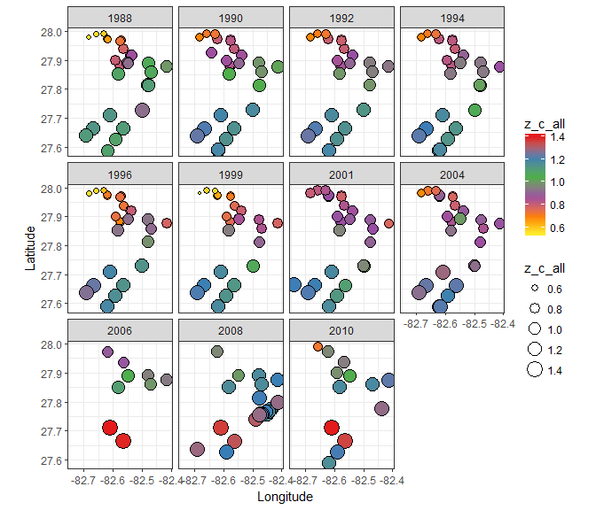
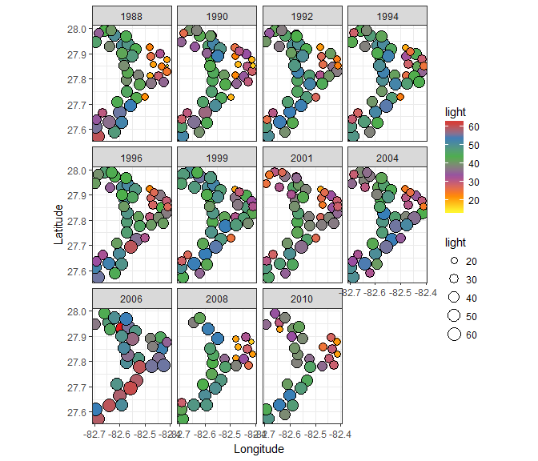
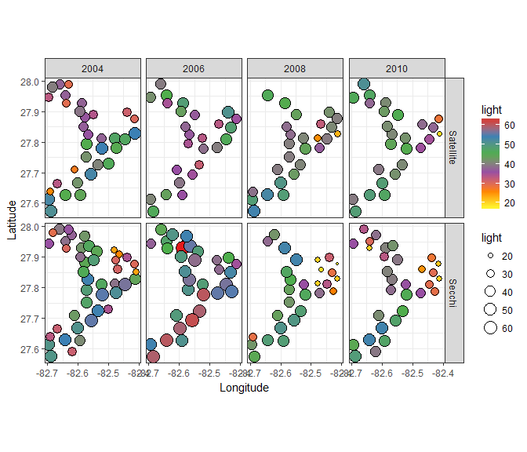
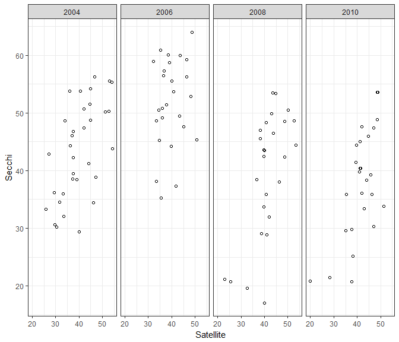

### Annual changes in depth of colonization and light requirements in Tampa Bay


Secchi data from the Tampa Bay Water Atlas ([link](http://www.tampabay.wateratlas.usf.edu/)) were obtained for all locations in the same years with seagrass coverage: 1988, 1990, 1992, 1994, 1996, 1999, 2001, 2004, 2006, 2008, and 2010.  Secchi data with a minimum of then monthly observations were averaged within each year at each location. 

Satellite data were available for 2003 through 2010, with four years overlapping with seagrass data.


```r
# load data
data(tb_seg)
data(tb_sats_all)
sats_melt <- reshape2::melt(tb_sats_all[['sats_all']], id.var = c('lat', 'lon'))

# color ramp
cols <- rev(c('blue', 'lightblue', 'yellow', 'brown'))

# prep data
to_plo <- sats_melt
to_plo$variable <- factor(to_plo$variable, labels = c('Average', seq(2003, 2010)))
seg_plo <- fortify(tb_seg)

# leg lab
leg_lab <- 'Clarity (m)'

# make plot
p <- ggplot(data = seg_plo) +
  geom_polygon(aes(x = long, y = lat, group = group), 
    colour = 'black', fill = colors()[245]) +
  geom_tile(data = subset(to_plo, !is.na(value)), 
    aes(x = lon, y = lat, fill = value, colour = value)
  ) +
  geom_polygon(aes(x = long, y = lat, group = group), 
    colour = 'black', fill = NA) +
  coord_equal() +
  facet_wrap(~ variable) + 
  scale_colour_gradientn(leg_lab, colours = cols) +
  scale_fill_gradientn(leg_lab, colours = cols) +
  scale_x_continuous(expand = c(0,0)) + 
  scale_y_continuous(expand = c(0,0)) +
  theme_classic() +
  theme(
    panel.grid.major = element_blank(),
    panel.grid.minor = element_blank(), 
    axis.title.x = element_blank(), 
    axis.title.y = element_blank(),
    axis.text.x = element_text(size = 8), 
    axis.text.y = element_text(size = 8), 
    legend.position = 'top'
    )
p
```

<!-- -->

Secchi and satellite clarity (m) by year, all matched locations:

```r
# polygon segment
data(tb_seg)

# secchi data
data(secc_all_tb)

# seagrass points
data(sgpts_all_tb)

# 1km seagrass buffer for clipping
data(sgbuff_2010_tb)

# satellite data, 2003 to 2010
data(tb_sats_all)

sat_dat <- tb_sats_all$sats_all
  
# yrs to eval, years with satellite data and seagrass coverage
# note that previous analysis averaged water clarity from sat data from 2006 to 2010
yrsinsat <- names(tb_sats_all$sats_all) %>% 
  grep('[0-9]+', ., value = T) %>% 
  gsub('^.*_', '', .)
yrsinsat <- yrsinsat[yrsinsat %in% names(secc_all_tb)]

out_ls <- vector('list', length = length(yrsinsat))
names(out_ls) <- yrsinsat

# process years
for(i in seq_along(yrsinsat)){
  
  source('R/funcs.R')
  
  # get yr index and data in the year
  yr <- yrsinsat[i]
  secc <- secc_all_tb[[yr]]

  # satellite data
  yrcol <- paste0('clarity_', yr)
  torast <- sat_dat[, c('lon', 'lat', yrcol)]
  sat_rast <- make_rast_fun(torast, yrcol)
  
  # extract secchi locations on sat data
  # sample the satellit clarity raster
  samp_vals <- raster::extract(sat_rast, secc, sp = T)
  samp_vals <- data.frame(samp_vals, ests = 'Satellite') %>% 
    .[, c('Longitude', 'Latitude', yrcol, 'ests')]
  names(samp_vals)[names(samp_vals) %in% yrcol] <- 'clarity'
  
  # format secchi data for combo with sat ests
  secc <- as.data.frame(secc) %>% 
    select(Longitude, Latitude, SD) %>% 
    rename(
      clarity = SD
      ) %>% 
    mutate(
      ests = 'Secchi'
      )
  
  out <- rbind(samp_vals, secc) %>% 
    data.frame(., yr= yr)
  
  out_ls[[i]] <- out

}

toplo <- do.call('rbind', out_ls) %>% 
  spread(ests, clarity)

ggplot(toplo, aes(x = Secchi, y = Satellite)) + 
  geom_point() + 
  geom_abline(yintercept = 0, slope = 1) + 
  facet_wrap(~yr) + 
  theme_bw()
```

```
## Warning: Ignoring unknown parameters: yintercept
```

```
## Warning: Removed 41 rows containing missing values (geom_point).
```

<!-- -->

Regression models comparing Satellite, Secchi all dates (2006 is removed in the second). Chen et al. 2007 report R2 of 0.67 between in situ secchi and satellie-derived Kd. 

```r
modall <- lm(Satellite ~ Secchi, toplo)
modno06 <- lm(Satellite ~ Secchi, toplo[!toplo$yr %in% '2006', ])
summary(modall)
```

```
## 
## Call:
## lm(formula = Satellite ~ Secchi, data = toplo)
## 
## Residuals:
##      Min       1Q   Median       3Q      Max 
## -0.92467 -0.32848 -0.02056  0.28565  1.27893 
## 
## Coefficients:
##             Estimate Std. Error t value Pr(>|t|)    
## (Intercept)  1.07229    0.09698   11.06   <2e-16 ***
## Secchi       0.44337    0.04134   10.73   <2e-16 ***
## ---
## Signif. codes:  0 '***' 0.001 '**' 0.01 '*' 0.05 '.' 0.1 ' ' 1
## 
## Residual standard error: 0.4101 on 151 degrees of freedom
##   (41 observations deleted due to missingness)
## Multiple R-squared:  0.4324,	Adjusted R-squared:  0.4286 
## F-statistic:   115 on 1 and 151 DF,  p-value: < 2.2e-16
```

```r
summary(modno06)
```

```
## 
## Call:
## lm(formula = Satellite ~ Secchi, data = toplo[!toplo$yr %in% 
##     "2006", ])
## 
## Residuals:
##      Min       1Q   Median       3Q      Max 
## -0.78567 -0.27926 -0.00947  0.26968  1.35266 
## 
## Coefficients:
##             Estimate Std. Error t value Pr(>|t|)    
## (Intercept)  0.76540    0.10357    7.39  1.5e-11 ***
## Secchi       0.61690    0.04746   13.00  < 2e-16 ***
## ---
## Signif. codes:  0 '***' 0.001 '**' 0.01 '*' 0.05 '.' 0.1 ' ' 1
## 
## Residual standard error: 0.3772 on 132 degrees of freedom
##   (37 observations deleted due to missingness)
## Multiple R-squared:  0.5614,	Adjusted R-squared:  0.558 
## F-statistic: 168.9 on 1 and 132 DF,  p-value: < 2.2e-16
```

Comparisons of satellite and secchi data, within 1km of seagrass:

```r
# secchi and satellite light ests, all years
data(tb_light_allsat)
data(tb_light_allsec)

sec <- reshape2::melt(tb_light_allsec, id.vars = names(tb_light_allsec[[1]])) %>% 
  mutate(est = 'Secchi')
sat <- reshape2::melt(tb_light_allsat, id.vars = names(tb_light_allsat[[1]])) %>% 
  mutate(est = 'Satellite')

# subset secchi data with estimable sat data
tb_ts <- rbind(sec, sat) %>%
  select(-Station_ID) %>% 
  rename(yr = L1)

ggplot(tb_ts, aes(x = factor(yr), y = SD, fill = est)) +
  geom_boxplot() +
  theme_bw() +
  facet_wrap(~seg, ncol = 1)
```

<!-- -->


```r
ggplot(tb_ts, aes(x = factor(yr), y = light, fill = seg)) +
  geom_boxplot() +
  theme_bw() + 
  facet_wrap(~est, ncol = 1)
```

<!-- -->

```r
summs <- group_by(tb_ts, seg, yr, est) %>% 
  summarise(
    SD = mean(SD), 
    z_c_all = mean(z_c_all), 
    light = mean(light)
  )
labs <- filter(summs, yr %in% c('1988', '2004', '2010')) %>% 
  filter(!(yr %in% '2004' & est %in% 'Secchi'))
ggplot(summs, aes(x = z_c_all, y = light, colour = seg)) +
  geom_path() +
  geom_point() + 
  geom_label(data = labs, aes(label = yr), size = 3, label.padding = unit(0.1, "lines")) +
  theme_bw() + 
  facet_wrap(~est, ncol = 1)
```

<!-- -->

```r
toplo1 <- filter(tb_ts, est %in% 'Secchi')
toplo2 <- filter(tb_ts, as.numeric(yr) > 2003)

ggplot(toplo1, aes(x = Longitude, y = Latitude, size = z_c_all, fill= z_c_all)) + 
  geom_point(pch = 21) + 
  facet_wrap( ~ yr) + 
  coord_equal() + 
  theme_bw() + 
  scale_fill_distiller(palette = 'Set1')
```

<!-- -->

```r
ggplot(toplo1, aes(x = Longitude, y = Latitude, size = light, fill= light)) + 
  geom_point(pch = 21) + 
  facet_wrap( ~ yr) + 
  coord_equal() + 
  theme_bw() + 
  scale_fill_distiller(palette = 'Set1')
```

<!-- -->

```r
ggplot(toplo2, aes(x = Longitude, y = Latitude, size = light, fill= light)) + 
  geom_point(pch = 21) + 
  facet_grid(est ~ yr) + 
  coord_equal() + 
  theme_bw() + 
  scale_fill_distiller(palette = 'Set1')
```

<!-- -->

```r
ggplot(toplo2, aes(x = Longitude, y = Latitude, size = z_c_all, fill= z_c_all)) + 
  geom_point(pch = 21) + 
  facet_grid(est ~ yr) + 
  coord_equal() + 
  theme_bw() + 
  scale_fill_distiller(palette = 'Spectral')
```

<!-- -->
