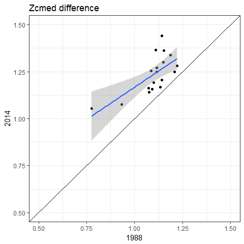

### Light requirements changes from 1988 to 2014


#### depth of colonization


```r
data(tb_light_allsec)

##
# formatting

# melt, rename yr
sec <- reshape2::melt(tb_light_allsec, id.vars = names(tb_light_allsec[[1]])) %>% 
  rename(yr = L1)

# complete yeear, locations
yrloc <- select(sec, yr, Longitude, Latitude) %>% 
  unite('lon_lat', Longitude, Latitude, remove = F) %>% 
  complete(lon_lat, yr) %>% 
  arrange(yr)

# locations that aren't common between all years
torm <- unique(yrloc$lon_lat[is.na(yrloc$Longitude)])

# remove unique locations, get 1988, 2014, take difference
tocmp <- unite(sec, 'lon_lat', Longitude, Latitude, remove = F) %>% 
  filter(!lon_lat %in% torm) %>% 
  rename(Segment = seg) %>% 
  select(lon_lat, yr, Longitude, Latitude, z_c_all) %>% 
  filter(yr %in% c(1988, 2014)) %>% 
  spread(yr, z_c_all) %>% 
  mutate(zcdif = `2014` - `1988`)

# light requirements between years
ggplot(tocmp, aes(x = `1988`, y = `2014`)) + 
  geom_point() + 
  theme_bw() + 
  geom_abline(intercept = 0, slope = 1) + 
  coord_cartesian(ylim = c(0.5, 1.5), xlim = c(0.5, 1.5)) +
  ggtitle('Zcmed difference')
```

<!-- -->

```r
# residual variation by location of difference in light requirements
ggplot(tocmp, aes(x = Longitude, y = Latitude, colour = zcdif, size = zcdif)) + 
  geom_point() + 
  coord_equal() + 
  theme_bw()
```

<!-- -->

```r
# t.test of difference
with(tocmp, t.test(zcdif))
```

```
## 
## 	One Sample t-test
## 
## data:  zcdif
## t = 7.0937, df = 17, p-value = 1.802e-06
## alternative hypothesis: true mean is not equal to 0
## 95 percent confidence interval:
##  0.09554008 0.17642970
## sample estimates:
## mean of x 
## 0.1359849
```

```r
# intercept only model of SI difference
mod1 <- gls(zcdif ~ 1,
  data = tocmp)
summary(mod1)
```

```
## Generalized least squares fit by REML
##   Model: zcdif ~ 1 
##   Data: tocmp 
##         AIC       BIC  logLik
##   -30.17959 -28.51316 17.0898
## 
## Coefficients:
##                 Value  Std.Error  t-value p-value
## (Intercept) 0.1359849 0.01916983 7.093692       0
## 
## Standardized residuals:
##         Min          Q1         Med          Q3         Max 
## -1.24918048 -0.86964815  0.01210872  0.36105353  1.98295530 
## 
## Residual standard error: 0.08133071 
## Degrees of freedom: 18 total; 17 residual
```

```r
# intercept only model of SI difference, lat/lon correlation structure
mod2 <- gls(zcdif ~ 1,
  correlation = corGaus(form = ~ Latitude + Longitude, nugget = TRUE), 
  data = tocmp)
summary(mod2)
```

```
## Generalized least squares fit by REML
##   Model: zcdif ~ 1 
##   Data: tocmp 
##         AIC       BIC   logLik
##   -40.40087 -37.06801 24.20043
## 
## Correlation Structure: Gaussian spatial correlation
##  Formula: ~Latitude + Longitude 
##  Parameter estimate(s):
##      range     nugget 
## 0.10688151 0.04121191 
## 
## Coefficients:
##                 Value Std.Error  t-value p-value
## (Intercept) 0.1614768 0.0538006 3.001393   0.008
## 
## Standardized residuals:
##         Min          Q1         Med          Q3         Max 
## -1.17066995 -0.88633435 -0.22574537  0.03567487  1.25076086 
## 
## Residual standard error: 0.1085606 
## Degrees of freedom: 18 total; 17 residual
```

```r
AIC(mod1, mod2)
```

```
##      df       AIC
## mod1  2 -30.17959
## mod2  4 -40.40087
```

```r
anova(mod1, mod2)
```

```
##      Model df       AIC       BIC   logLik   Test  L.Ratio p-value
## mod1     1  2 -30.17959 -28.51316 17.08979                        
## mod2     2  4 -40.40087 -37.06801 24.20043 1 vs 2 14.22128   8e-04
```

#### light requirements


```r
data(tb_light_allsec)

##
# formatting

# melt, rename yr
sec <- reshape2::melt(tb_light_allsec, id.vars = names(tb_light_allsec[[1]])) %>% 
  rename(yr = L1)

# complete yeear, locations
yrloc <- select(sec, yr, Longitude, Latitude) %>% 
  unite('lon_lat', Longitude, Latitude, remove = F) %>% 
  complete(lon_lat, yr) %>% 
  arrange(yr)

# locations that aren't common between all years
torm <- unique(yrloc$lon_lat[is.na(yrloc$Longitude)])

# remove unique locations, get 1988, 2014, take difference
tocmp <- unite(sec, 'lon_lat', Longitude, Latitude, remove = F) %>% 
  filter(!lon_lat %in% torm) %>% 
  rename(Segment = seg) %>% 
  select(lon_lat, yr, Longitude, Latitude, light) %>% 
  filter(yr %in% c(1988, 2014)) %>% 
  spread(yr, light) %>% 
  mutate(sidif = `2014` - `1988`)

# light requirements between years
ggplot(tocmp, aes(x = `1988`, y = `2014`)) + 
  geom_point() + 
  theme_bw() + 
  geom_abline(intercept = 0, slope = 1) + 
  coord_cartesian(ylim = c(0, 100), xlim = c(0, 100)) +
  ggtitle('SI difference')
```

<!-- -->

```r
# residual variation by location of difference in light requirements
ggplot(tocmp, aes(x = Longitude, y = Latitude, colour = sidif, size = sidif)) + 
  geom_point() + 
  coord_equal() + 
  theme_bw()
```

<!-- -->

```r
# t.test of difference
with(tocmp, t.test(sidif))
```

```
## 
## 	One Sample t-test
## 
## data:  sidif
## t = 4.4335, df = 17, p-value = 0.0003641
## alternative hypothesis: true mean is not equal to 0
## 95 percent confidence interval:
##  2.688252 7.569878
## sample estimates:
## mean of x 
##  5.129065
```

```r
# intercept only model of SI difference
mod1 <- gls(sidif ~ 1,
  data = tocmp)
summary(mod1)
```

```
## Generalized least squares fit by REML
##   Model: sidif ~ 1 
##   Data: tocmp 
##        AIC      BIC    logLik
##   109.2254 110.8919 -52.61272
## 
## Coefficients:
##                Value Std.Error  t-value p-value
## (Intercept) 5.129065  1.156885 4.433515   4e-04
## 
## Standardized residuals:
##        Min         Q1        Med         Q3        Max 
## -1.7632801 -0.6761684 -0.1307283  0.5684561  1.7955017 
## 
## Residual standard error: 4.908246 
## Degrees of freedom: 18 total; 17 residual
```

```r
# intercept only model of SI difference, lat/lon correlation structure
mod2 <- gls(sidif ~ 1,
  correlation = corGaus(form = ~ Latitude + Longitude, nugget = TRUE), 
  data = tocmp)
summary(mod2)
```

```
## Generalized least squares fit by REML
##   Model: sidif ~ 1 
##   Data: tocmp 
##        AIC      BIC    logLik
##   103.5805 106.9133 -47.79024
## 
## Correlation Structure: Gaussian spatial correlation
##  Formula: ~Latitude + Longitude 
##  Parameter estimate(s):
##      range     nugget 
## 0.34850237 0.04341715 
## 
## Coefficients:
##                Value Std.Error   t-value p-value
## (Intercept) 5.608698  9.961507 0.5630371  0.5808
## 
## Standardized residuals:
##         Min          Q1         Med          Q3         Max 
## -0.68421693 -0.28452843 -0.08399143  0.17307133  0.62420800 
## 
## Residual standard error: 13.34993 
## Degrees of freedom: 18 total; 17 residual
```

```r
AIC(mod1, mod2)
```

```
##      df      AIC
## mod1  2 109.2254
## mod2  4 103.5805
```

```r
anova(mod1, mod2)
```

```
##      Model df      AIC      BIC    logLik   Test  L.Ratio p-value
## mod1     1  2 109.2254 110.8919 -52.61272                        
## mod2     2  4 103.5805 106.9133 -47.79024 1 vs 2 9.644969   0.008
```
